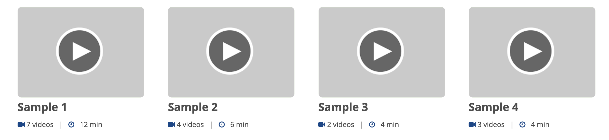

<link href="https://fonts.googleapis.com/icon?family=Material+Icons" rel="stylesheet">

    

        
 Choreo is a digital innovation platform that allows you to develop, deploy, and manage cloud-native applications at scale via an AI-powered, low-code application development environment.

        
This learning portal allows you to easily browse through Choreo documentation, video tutorials, webinars, and all other resources to learn about Choreo and its capabilities.

Select a topic and dive in to learn how to use Choreo to build enterprise-class applications fast while ensuring best practices and secure coding guidelines:
 
    

   
 
     

		

           	

			<i class="material-icons md-36">timer</i>
		

		

			
Get to Know Choreo

			
			
 Learn about the key capabilities of Choreo and understand the basic concepts.

      		

		

      <!-- card -->
      

            

            
<i class="material-icons md-36">create</i>

            

                
Build Integrations

                
Learn how to use Choreo to build enterprise-class integrations efficiently.

             

      

      <!-- end card -->
      <!-- card -->
      

            

            
<i class="material-icons md-36">input</i>

            

Work with Services

            
 Explore how you can build RESTFul services with Choreo.

      

      <!-- end card -->
 

 

      <!-- end card -->
      <!-- end card -->
      <!-- card -->
   <!-- card -->
      

	    

            
<i class="material-icons md-36">security</i>

            

		
Manage APIs

		
Learn how to expose Choreo services or external APIs as managed APIs.

            

      

      

	    

            
<i class="material-icons md-36">traffic</i>

            

		
Observe Applications

		
Explore how you can observe applications to get insights and assess performance.

            

      

        <!-- end card -->
      <!-- card -->
      

            

            
<i class="material-icons md-36">store</i>

            

Explore Business Scenarios

            
 Follow step-by-step tutorials to build common integration scenarios.

      
 

      <!-- end card -->
  

Browse through our video tutorials to get up-to-speed with Choreo fast:

Explore the latest Choreo resources to stay up to date:

